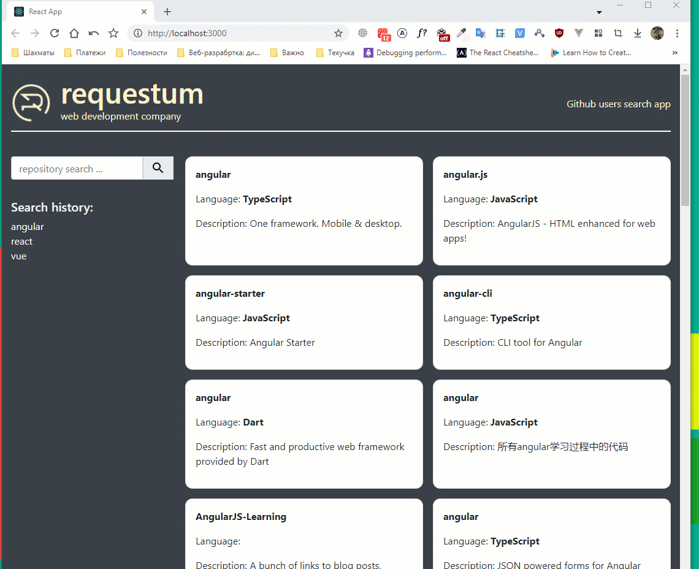

## Github Search

#### Single page application (SPA), which lists the repositories and organizations by search term

---

_SPA uses:_

1. State managemen: hooks useReducer(), useState(), createContext()
2. Types checking: npm module [prop-types](https://www.npmjs.com/package/prop-types)
3. Responsive layout created on CSS grid and scss
4. Search component with debounce input: npm module [react-debounce-input](https://www.npmjs.com/package/react-debounce-input)

_Besides:_

1. Previous requests are shown in the search component module, the maximum number of displayed requests is 5
2. Search history available after reloading the page

---

### Demo gif: how this app works

---

[Сайт](https://asp-githubreposearch.web.app/ 'Right click to open site in separate window')

---
